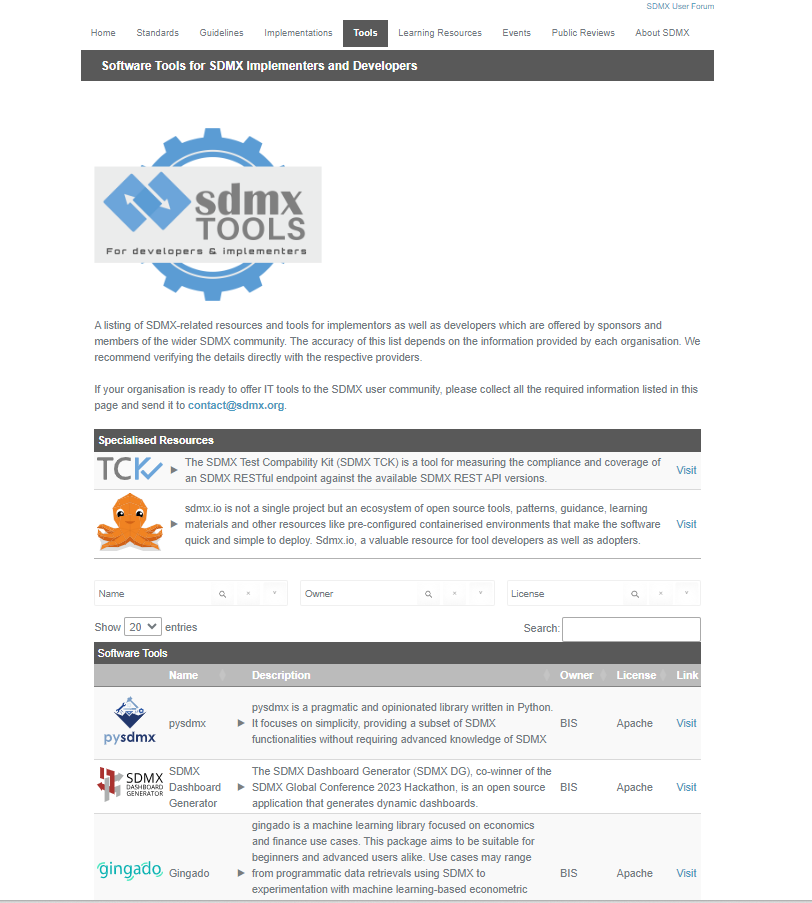
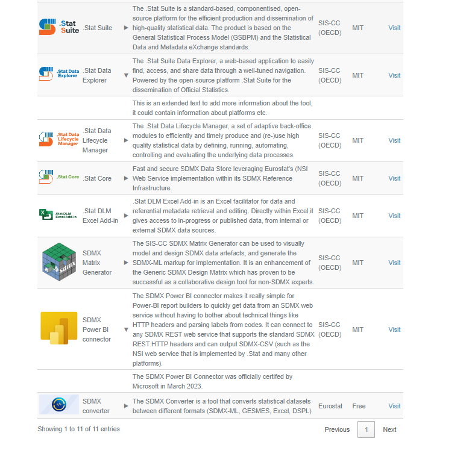

# sdmx-tools-catalogue
Welcome to the Central inventory for SDMX tools resources GitHub project and source code repository.

This repository is linked to the Learning Resources page at [sdmx.org tools page](https://sdmx.org/?page_id=4500/) that is maintained by the SDMX Secretariat.

------------------------------------------

**How to add a tool to the Tools Resources page**

There are three ways in which to submit a request for adding a tool to the Tools page:

1. Send an email to contact@sdmx.org providing the necessary information as detailed below.

2. Create an issue <a href="https://github.com/SDMX-Outreach/sdmx-learning-catalogue/issues">here</a>, click the "New issue" button and then "Get started" and provide the necessary information, in the form that will open, as detailed below.
   
3. Fork the main branch (or clone it locally), make the changes completing the necesssary information as detailed below, and submit a pull request
Under the repository code, locate and open the catalogue.json file. Depending on the number of new entries you wish to add, you can copy an existing entry and then paste it immediately below the one that you copied replacing the values with the new information. Once complete, you can submit your pull request with a comment summarising the changes made. A project maintainer will then review the pull request to ensure it is suitable for merging with the main branch. They may reply with a comment requesting further information or clarifications, or in some cases changes. Once approved the changes will be merged with the main branch and made available on sdmx.org.

*In all cases the following information is required:*

- **Name:** Short and precise name of the tool
- **Description:** Short and concise description with a few lines of the tool
- **Supported features:** A few bullet points of what the tool supports. Basic html tags like &lt;ul&gt; &lt;/ul&gt; can be used to create the list
- **Owner:** The organisation reposible for the tool
- **License:** License needed for the tool, e.g. Apache, MIT or if no license just Free
- **URL:** Link to access the tool information, if no external page is available an internal page on sdmx.org can be created
- **Image:** URL to an online image to be used as a thumbnail for the listing (please make sure it is licence free)

------------------------------------------
## Example of the tools page

<table border-style: none;><tr><td><td><td></td></tr></table>
